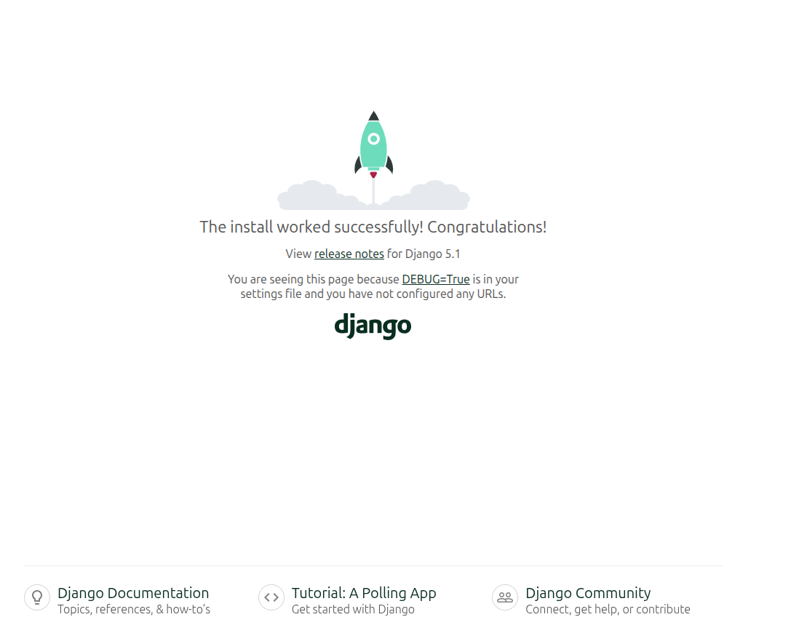

# Serviço Web Django com Docker 🚀

Projeto desenvolvido em formato de Sprint (1 semana) para criar e empacotar uma aplicação web simples usando Django, isolando suas dependências em um container com Dockerfile e orquestrando a execução através do Docker Compose.

## 🛠️ Pré-requisitos

Para rodar este projeto na sua máquina, você precisará ter as seguintes ferramentas instaladas:

- [Git](https://git-scm.com/)
- [Docker](https://www.docker.com/)
- [Docker Compose](https://docs.docker.com/compose/)

## ⚙️ Como executar

1.  Clone o repositório:

``` bash
git clone https://github.com/WellingtonViniciuz/servico-django-docker.git
```

2.  Acesse a pasta do projeto:

``` bash
cd servico-django-docker
```

3.  Construa a imagem e inicie os containers:

``` bash
docker compose up --build
```

4.  Abra o navegador e acesse:

``` text
http://localhost:8000
```
## 📷 Resultado esperado

Se tudo estiver configurado corretamente, a aplicação estará disponível
no endereço acima e será exibida a imagem abaixo:

